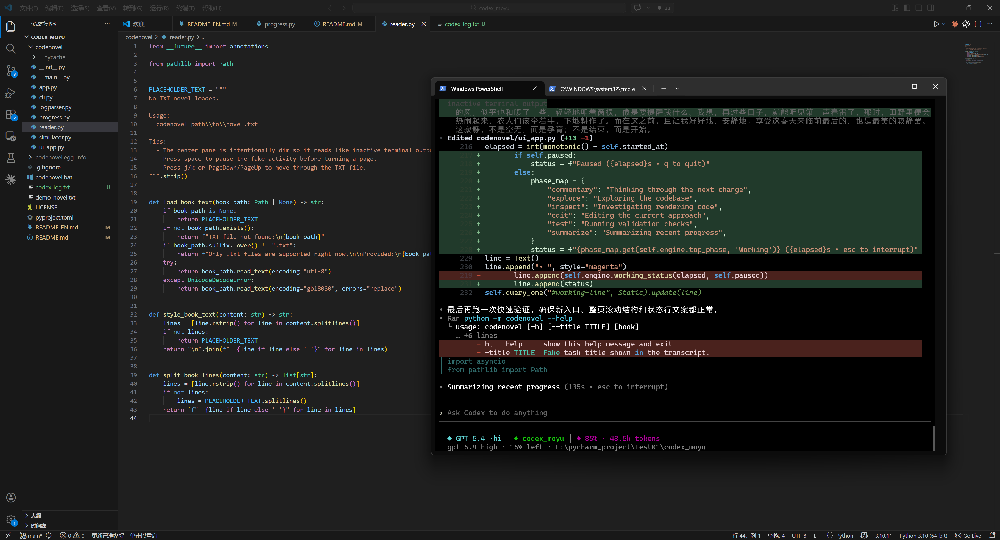

# CodeNovel

[English README](./README_EN.md)

CodeNovel 是一个基于 Textual 的终端小项目。它会模拟出类似 Codex CLI 正在工作的界面，同时把一份 TXT 文本隐藏在屏幕中间，并伪装成一块灰掉的“非活动终端输出”。

它支持两种运行模式：
- 合成模式：自动生成看起来比较真实的命令、diff、警告、进度和总结输出。
- 回放模式：解析真实的 Codex CLI 日志，并在同一套界面里回放出来。

它本质上是一个“终端伪装器 + TXT 阅读器”的组合项目。

## 演示

<table>
  <tr>
    <td width="50%" align="center">
      <a href="./demo.jpg">
        
      </a>
    </td>
    <td width="50%" align="center">
      <a href="./demo.mp4">
        
      </a>
    </td>
  </tr>
</table>

- 动图预览：[`demo.gif`](./demo.gif)
- 图片预览：[`demo.jpg`](./demo.jpg)
- 视频演示：[`demo.mp4`](./demo.mp4)

## 项目简介

这个项目的核心乐趣很明确：
- 屏幕看起来像 AI 正在认真写代码
- 中间那块不起眼的区域其实在显示你真正想看的 TXT 内容
- 周围不断滚动的终端活动会让整个界面保持“正在工作”的错觉

如果你喜欢终端 UI、Codex 风格界面、带一点恶作剧意味的工具，或者单纯想做一个隐蔽阅读器，这个项目就是为这种场景做的。

## 功能特性

- 基于 [Textual](https://github.com/Textualize/textual) 和 Rich 构建的 Codex 风格终端界面
- 将 TXT 文本伪装成灰暗的“失活输出”进行阅读
- 内置合成活动流，包含命令、摘要、diff、警告和进度输出
- 支持通过 `--log` 回放真实 Codex CLI 日志
- 支持键盘和鼠标滚轮控制中间阅读区
- 支持通过参数开启或关闭阅读区随机纯白高亮行
- 自动记住每本 TXT 上次阅读到的原始行号
- 支持通过参数指定从原 TXT 的第几行开始阅读
- 底部状态栏显示模型、提供方、token 数和项目路径
- 支持 UTF-8 和 `gb18030` 两种 TXT 编码读取

## 运行要求

- Python 3.10 及以上
- 支持较好 Unicode 和 24 位颜色的终端

为了获得更接近设计效果的显示，建议使用 Windows Terminal、iTerm2、WezTerm 这类现代终端。传统 `cmd` 也能运行，但字形和颜色表现可能会更粗糙一些。

## 安装

在项目根目录执行：

```bash
pip install .
```

开发模式安装：

```bash
pip install -e .
```

如果当前环境没有把 `codenovel` 脚本加入 `PATH`，可以直接使用：

```bash
python -m codenovel
```

Windows 下仓库中还带了一个本地启动包装脚本 [`codenovel.bat`](./codenovel.bat)，在项目目录里可以直接调用。

## 快速开始


推荐测试方式：

```bash
codenovel .\demo_novel.txt --log .\codex_log.txt --bottom-interval 1.5
```


读取一份 TXT 文件：

```bash
codenovel path/to/novel.txt
```

从原 TXT 的第 1200 行开始阅读，这会覆盖已保存的阅读进度：

```bash
codenovel path/to/novel.txt --start-line 1200
```

让中间 TXT 阅读区随着底部活动一起自动滚动：

```bash
codenovel path/to/novel.txt --follow-log-scroll
```

加快底部活动流刷新速度：

```bash
codenovel path/to/novel.txt --bottom-interval 2.5
```

回放真实的 Codex 日志，而不是生成伪造活动流：

```bash
codenovel path/to/novel.txt --log path/to/codex-session.txt
```

关闭小说阅读区里随机出现的纯白高亮行：

```bash
codenovel path/to/novel.txt --no-reader-highlight
```

自定义顶部假任务标题：

```bash
codenovel path/to/novel.txt --title "Refactor transcript renderer"
```

不传入 TXT 文件时，会显示项目内置的占位说明：

```bash
codenovel
```

## 操作方式

- `j` 或 `Down`：向下滚动隐藏阅读区
- `k` 或 `Up`：向上滚动隐藏阅读区
- `PageDown`：快速向下滚动
- `PageUp`：快速向上滚动
- `space`：暂停或继续合成 / 回放活动
- `q`：退出
- 鼠标滚轮放在中间阅读区上：只滚动 TXT 内容，不滚动外层主转录区域

## 命令行参数

```text
usage: codenovel [-h] [--title TITLE] [--model MODEL] [--provider PROVIDER]
                 [--model-full MODEL_FULL] [--project PROJECT] [--log LOG]
                 [--bottom-interval BOTTOM_INTERVAL] [--follow-log-scroll]
                 [--no-follow-log-scroll] [--reader-highlight]
                 [--no-reader-highlight] [--start-line START_LINE]
                 [book]
```

参数说明：

- `book`：要读取的 `.txt` 文件路径
- `--title`：显示在转录内容里的假任务标题
- `--model`：底部状态栏显示的模型简称
- `--provider`：模型名称后面的提供方标签
- `--model-full`：底部第二行显示的完整模型描述
- `--project`：底部状态栏显示的项目名
- `--log`：真实 Codex 终端日志路径，用于解析和回放
- `--bottom-interval`：底部活动流的刷新间隔秒数
- `--follow-log-scroll`：让 TXT 阅读区跟随底部活动自动滚动
- `--no-follow-log-scroll`：保持 TXT 阅读区与底部活动独立
- `--reader-highlight`：启用阅读区随机纯白高亮行
- `--no-reader-highlight`：关闭阅读区随机纯白高亮行
- `--start-line`：从原 TXT 的第几行开始阅读，使用 1-based 行号，并覆盖已保存进度

## 输入文件说明

- 当前只支持 `.txt` 文件。
- 读取时会优先按 UTF-8 解码，失败后自动回退到 `gb18030`。
- 如果文件路径不存在，界面中间会直接显示错误信息。
- 如果 TXT 内容为空，会回退到项目内置的占位文本。
- 阅读进度会按原始 TXT 行号保存在 `~/.codenovel/progress.json`。
- 未传 `--start-line` 时，程序默认恢复到上次阅读位置。

## 项目结构

CodeNovel 目前主要由下面几个模块组成：

- [`codenovel/ui_app.py`](./codenovel/ui_app.py)：主界面、布局、颜色、滚动逻辑和 diff 渲染
- [`codenovel/simulator.py`](./codenovel/simulator.py)：合成终端活动流生成器
- [`codenovel/logparser.py`](./codenovel/logparser.py)：真实 Codex CLI 日志解析器
- [`codenovel/progress.py`](./codenovel/progress.py)：每本 TXT 的阅读进度记录
- [`codenovel/reader.py`](./codenovel/reader.py)：TXT 读取与分行处理
- [`codenovel/cli.py`](./codenovel/cli.py)：命令行参数解析与应用启动入口

## 开发

直接从源码运行：

```bash
python -m codenovel demo_novel.txt
```

开发模式安装：

```bash
pip install -e .
```

仓库里几个比较重要的文件：

- [`demo_novel.txt`](./demo_novel.txt)：示例 TXT 文本
- [`pyproject.toml`](./pyproject.toml)：包元数据和依赖配置

## License

项目当前采用 MIT License，具体见 [`LICENSE`](./LICENSE) 和 [`pyproject.toml`](./pyproject.toml)。
